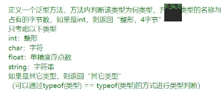
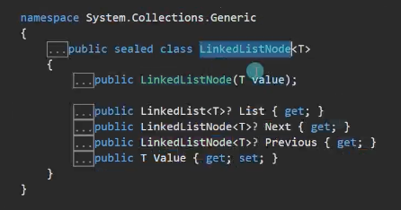
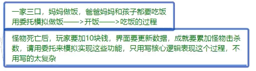

# 简单数据结构类

## ArrayList

Object类型的数组

### 申明

```csharp
        //ArrayList的申明
        ArrayList arr1 = new ArrayList();
```

### 增删查改

```csharp
        //增删查改

        //  增
        //尾插法
        //可以增任何类型
        arr1.Add("张三");
        arr1.Add(1);
        arr1.Add(true);
        arr1.Add(new object());
        //批量增加，把另一个list容器里的所有元素都添加到当前容器的后面
        arr1.AddRange(new ArrayList() { "张三", "李四", "王五" });
        //在中间指定位置插入
        arr1.Insert(2, "111111");
        //批量插入
        arr1.InsertRange(3, new ArrayList() { "123", "234", "345" });

        //  删
        //从前往后遍历，删除首个匹配的元素
        arr1.Remove("张三");
        //删除指定位置的元素
        arr1.RemoveAt(0);
        //清空
        //  arr1.Clear();

        //  查
        //获取指定位置的元素
        Console.WriteLine(arr1[0]);
        //查看元素是否存在
        if (arr1.Contains("1")) Console.WriteLine("存在");
        //正向查找元素位置，找不到返回-1
        int index = arr1.IndexOf(true);
        Console.WriteLine(index);
        //反向查找元素位置，返回的索引还是从前开始计数的，找不到返回-1
        index = arr1.LastIndexOf(true);
        Console.WriteLine(index);

        //  改
        arr1[0] = "999";
        Console.WriteLine(arr1[0]);

        Console.WriteLine();

        //长度，数组的元素个数
        Console.WriteLine(arr1.Count);
        //容量
        //用来避免每次改动数组都产生垃圾，有了容量的存在，只有扩容的时候才产生垃圾
        Console.WriteLine(arr1.Capacity);

        //遍历
        //一般的遍历
        for (int i = 0; i < arr1.Count; i++)
        {
            Console.WriteLine(arr1[i]);
        }
        //迭代器遍历
        foreach (object obj in arr1)
        {
            Console.WriteLine(obj);
        }   

```

### 排序和反转

和数组一样

```csharp
arr1.Sort();
arr1.Reverse();
```

### 装箱拆箱

```csharp
        #region 装箱拆箱
        //ArrayList本质是一个可以自动扩容的object数组
        //装箱：进行值类型的储存
        //拆箱：进行值类型的取出
        //所以尽量选择其他的数据容器

        int num = 1;
        arr1[0] = num;    //装箱
        num = (int)arr1[0];   //拆箱
  
        #endregion
```

### ArrayList和数组的区别

ArrayList本质是object数组

| 功能                   | 数组                                       | `ArrayList`                                                                  |
| ---------------------- | ------------------------------------------ | ------------------------------------------------------------------------------ |
| **获取长度**     | `数组名.Length`                          | `数组名.Count`                                                               |
| **访问元素**     | `数组名[index]`（直接访问）              | `数组名[index]`（需拆箱）                                                    |
| **修改元素**     | `数组名[index] = value`                  | `数组名[index] = value`                                                      |
| **排序**         | `Array.Sort(数组名)`                     | `数组名.Sort()`                                                              |
| **反转**         | `Array.Reverse(数组名)`                  | `数组名.Reverse()`                                                           |
| **查找索引**     | `Array.IndexOf(数组名, value)`           | `数组名.IndexOf(value)`                                                      |
| **元素是否存在** | ❌                                         | `数组名.Contains(value)`                                                     |
| **清空**         | `Array.Clear(数组名, startIndex, count)` | `数组名.Clear()`                                                             |
| **增删方法**     | 增删方法需要自己写                         | 内置                                                                           |
| **添加元素**     | ❌ 固定大小，不能动态添加                  | `数组名.Add(value)`                                                          |
| **插入元素**     | ❌ 不支持                                  | `数组名`.Insert(index, value)<br />`数组名`.InsertRange(index, 一个集合); |
| **批量添加**     | ❌ 不支持                                  | `数组名`.AddRange(一个集合)                                                  |
| **删除元素**     | ❌ 不支持                                  | `数组名`.Remove(value)<br />RemoveAt(index)                                  |
| **自动扩容**     | ❌ 定长                                   | ✅ 是                                                                          |
| **类型安全**     | ✅ 是                                      | ❌ 否（需手动强制转换）                                                        |
| **性能**         | 高(只要数组不是object数组就不存在装箱拆箱) | 相对较低（存在装箱/拆箱）                                                      |

> 习题


```csharp
using System.Collections;

class Bag
{
    private ArrayList items;

    private int money;

    public Bag(int money)
    {
        this.money = money;
        items = new ArrayList();
    }
    public void BuyItem(Item item)
    {
        //物品信息错误
        if (item.num <= 0 || item.price <= 0)
        {
            Console.WriteLine("物品信息有误");
            return;
        }
        //金钱变化
        if (money < item.price * item.num)
        {
            Console.WriteLine("钱不够");
            return;
        }
        money -= item.price * item.num;
        //添加物品
        foreach (Item i in items)
        {
            //如果已经在背包里面，必须要比较UID
            //  因为传入的item不会和items里的item是同一个对象，所以要判断UID
            if (i.UID == item.UID)
            {
                //叠加数量
                i.num += item.num;
                return;
            }
        }
        items.Add(item);
        Console.WriteLine("买了{0}个{1}，共花费{2}元", item.num, item.name, item.price * item.num);
        ShowItems();
    }
    //根据item卖
    public void SellItem(Item item)
    {
        //遍历物品
        foreach (Item i in items)
        {
            //要卖的东西在背包里有，必须要比较UID
            if (i.UID == item.UID)
            {
                string name = i.name;
                int price = i.price;
                int sellNum = item.num;
                //买的数量判定
                if (i.num < item.num)
                {
                    sellNum = i.num;  //要卖出的数量超出已有，只能卖出已有的全部
                }
                i.num -= sellNum;
                money += (int)(sellNum * price * 0.8f);
                Console.WriteLine("卖了{0}个{1}，共获得{2}元", sellNum, name, (int)(sellNum * price * 0.8f));
                if (i.num <= 0) items.Remove(i);    //卖完了就要移除当前遍历的该项
                ShowItems();
                return;
            }
        }
        Console.WriteLine("没有这个物品");
        return;
    }
    //根据UID卖
    public void SellItem(int UID, int num = 1)
    {
        Item item = new Item();
        item.UID = UID;
        item.num = num;
        SellItem(item);
    }
    public void ShowItems()
    {
        foreach (Item item in items)
        {
            Console.Write("有{0}个{1}，", item.num, item.name);
        }
        Console.WriteLine("现在手里有{0}元",money);
    }
}

class Item
{
    //单价
    public int price;
    public int UID;
    public string name;
    public int num;
    public Item()
    {
    }
    public Item(int UID, int price, string name, int num)
    {
        this.UID = UID;
        this.price = price;
        this.name = name;
        this.num = num;
    }
}

class Program
{
    static void Main()
    {
        Bag bag = new Bag(10000);
        Item i1 = new Item(1, 10, "sb", 10);
        Item i2 = new Item(2, 20, "sb2", 20);
        Item i3 = new Item(3, 999, "sb3", 3);

        bag.BuyItem(i1);
        bag.BuyItem(i2);
        bag.BuyItem(i3);

        bag.SellItem(2);
        bag.SellItem(i1);

        bag.SellItem(i1);

    }
}
```

## Stack

本质是object[]数组

栈储存容器，后进先出

### 栈的使用

```csharp
using System.Collections;


//栈的申明
Stack stack = new Stack();

//增删查改

//压栈
stack.Push("1");
stack.Push(true);
stack.Push(1);
stack.Push(new Test());

//出栈
object o1 = stack.Pop();
Console.WriteLine(o1);

//查看栈顶
object o2 = stack.Peek();
Console.WriteLine(o2);
//是否在栈中
if (stack.Contains(1)) Console.WriteLine("存在1");

//清空
//  stack.Clear();

//遍历
//1.长度
Console.WriteLine(stack.Count);
//2.用foreach遍历
foreach (object o in stack)
{
    Console.WriteLine(o);
}
//3.转成object数组遍历,顺序也是从栈顶到栈底
object[] arr = stack.ToArray();
for (int i = 0; i < arr.Length; i++)
{
    Console.WriteLine(arr[i]);
}

Console.WriteLine();
Console.WriteLine(stack.Count);
//4.循环弹栈
while (stack.Count > 0)
{
    Console.WriteLine(stack.Pop());
}
Console.WriteLine(stack.Count);


class Test
{

}

```

### 栈的装箱拆箱

因为栈的本质还是object[]数组

所以当进行值类型存储(入栈值类型对象)的时候就是装箱，把值类型对象取出来(出栈值类型对象)**转换使用**就是拆箱。

```csharp
//装箱
stack.Push(1);     // int 值类型 → object 引用类型（装箱）
stack.Push(true);  // bool 值类型 → object 引用类型（装箱）
//拆箱
object o = stack.Pop();
int num = (int)o;  // 拆箱：object → int
```

> 如何避免装箱拆箱？

泛型集合：栈泛型 Stack `<Type>`

相当于一个只有栈的存储特性(后进先出)的集合，缺点就是只能存指定类型的元素

入栈出栈都是直接存取，不存在装箱拆箱

```csharp
Stack<int> stack = new Stack<int>();
stack.Push(100);
int value = stack.Pop();  // 直接获取 int，无需拆箱
```

### 栈的应用

UI的显示逻辑(每次点击的面板总是显示在最前面)

高进制转低进制

> 习题


对于取出一个后进先出的数组，可以用栈来解决

```csharp
using System.Collections;

Console.WriteLine("请输入一个整数");
uint num = (uint.Parse)(Console.ReadLine());
DecToBinary(num);

static void DecToBinary(uint num)
{
    Stack stack = new Stack();
    while (num != 0)
    {
        stack.Push(num % 2);
        num /= 2;
    }
    Console.Write("二进制为：");
    while (stack.Count != 0)
    {
        Console.Write(stack.Pop());
    }
    Console.WriteLine();
}

```

## Queue

本质是object[]数组，先进先出，类似管道

### 队列的使用

```csharp
using System.Collections;

Queue queue = new Queue();
//增删查改
//入队  
queue.Enqueue(1);
queue.Enqueue(2);
queue.Enqueue(3);
queue.Enqueue(new Test());
//出队
object o = queue.Dequeue();
Console.WriteLine(o);
//查看队头
o = queue.Peek();
Console.WriteLine(o);
//是否在队列中
if (queue.Contains(3)) Console.WriteLine("在队列中");
//清空
//  queue.Clear();

//遍历
//1.长度
Console.WriteLine(queue.Count);
//2.用foreach遍历
foreach (object item in queue)
{
    Console.WriteLine(item);
}
//3.转成object[]数组遍历
object[] arr = queue.ToArray();
for (int i = 0; i < arr.Length; i++)
{
    Console.WriteLine(arr[i]);
}
//4.循环出队列
while (queue.Count > 0)
{
    Console.WriteLine(queue.Dequeue());
}   

class Test
{

}
```

### 队列的装箱拆箱

```csharp
//装箱
queue.Enqueue(123);
//拆箱
int num = (int)queue.Dequeue(); 
```

和栈一样，用**泛型 `Queue<Type> 就可以避免装箱拆箱`**

> 习题


```csharp
using System.Collections;

Queue queue = new Queue();
for (int i = 0; i < 10; i++)
{
    queue.Enqueue(i);
}
while (queue.Count > 0)
{
    Console.WriteLine(queue.Dequeue());
    //隔停100毫秒
    Task.Delay(100).Wait();
}
```

## Hashtable

哈希表/散列表，本质是一个字典

是基于键的哈希代码组织起来的键值对 `<key,value>`

用键来访问集合中的元素

### 哈希表的使用

```csharp
using System.Collections;

Hashtable hashtable = new Hashtable();

//增删查改

//增
//可以有相同value，但是不能有相同key
hashtable.Add(1, 123);
hashtable.Add("123", 321);
hashtable.Add(true, false);
//或者直接用索引器加，用索引器加相同key的时候相当于改了对应value
hashtable[1] = 123;

//删
//1.只能通过key来删
hashtable.Remove(1);
//2.删除不存在的键，不会报错
hashtable.Remove("1");
//3.清空
//  hashtable.Clear();

//查
//1.通过key来查，找不到返回空
Console.WriteLine(hashtable[1]);
//2.通过key查是否存在键值对
if (hashtable.Contains("123")) Console.WriteLine("存在");
if (hashtable.ContainsKey("123")) Console.WriteLine("存在");
//3.通过value查是否存在键值对
if (hashtable.ContainsValue(321)) Console.WriteLine("存在");

//改
//只能改key对应的value，不能改key
hashtable[1] = 321;
Console.WriteLine(hashtable[1]);

//遍历
//键值对数
Console.WriteLine(hashtable.Count);
//通过key遍历：可以遍历key和value
foreach (var key in hashtable.Keys)
{
    Console.WriteLine("key:{0},value:{1}",key ,hashtable[key]);
}
//通过value遍历：只能遍历value
foreach (var value in hashtable.Values)
{
    Console.WriteLine("value:{0}",value);
}
//迭代器遍历键值对
foreach (var item in hashtable)
{
    Console.WriteLine(item);
}
//迭代器遍历
IDictionaryEnumerator enumerator = hashtable.GetEnumerator();
bool flag = enumerator.MoveNext();
while (flag)
{
    Console.WriteLine("key:{0},value:{1}",enumerator.Key,enumerator.Value);
    flag = enumerator.MoveNext();
}
```

> 注意：哈希表的键值对**排列顺序，取决于 key 的哈希码和冲突处理机制**，并不是按照插入顺序排列的

> 关于迭代器：
>
> foreach**底层调用的就是 `GetEnumerator()`**

### 哈希表的装箱拆箱

本质是object容器，字典，所以必然存在装箱拆箱

```csharp
Hashtable table = new Hashtable();

// 装箱：int → object
table.Add(1, 100);     // key 和 value 都是值类型，会装箱

// 拆箱：object → int
int key = 1;
int value = (int)table[key];  // 拆箱操作
```

> 用字典泛型Dictionary `<Type,Type>`来避免装箱拆箱：

```csharp
Dictionary<int, int> dict = new Dictionary<int, int>();
dict.Add(1, 100);//直接加
int value = dict[1];  // 直接取用
```

> 习题


```csharp
using System.Collections;

for (int i = 0; i < 10; i++)
{
    MonsterManager.Instance.AddMonster();
}
MonsterManager.Instance.RemoveMonster(1);
MonsterManager.Instance.RemoveMonster(5);


class MonsterManager
{
    //要让管理器是唯一的 所以用单例模式来实现
    private static MonsterManager _instance = new MonsterManager();
    public static MonsterManager Instance
    {
        get
        {
            return _instance;
        }
    }

    private Hashtable monsterTable = new Hashtable();
    //不让在外面new
    private MonsterManager()
    {

    }

    private int monsterID = 0;
    public void AddMonster()
    {
        Monster monster = new Monster(monsterID);
        monsterTable.Add(monster.id, monster);
        (monsterTable[monsterID] as Monster).Generate();
        monsterID++;
    }

    public void RemoveMonster(int id)
    {
        if (monsterTable.ContainsKey(id))
        {
            (monsterTable[id] as Monster).Dead();
            monsterTable.Remove(id);
        }
    }
}

class Monster
{
    public int id;
    public Monster(int id)
    {
        this.id = id;
    }
    public void Generate()
    {
        Console.WriteLine("生成怪物{0}", id);
    }
    public void Dead()
    {
        Console.WriteLine("怪物{0}死亡", id);
    }
}
```

> 关于单例模式，这个在C# 核心里面提到过


这就是一个标准的单例模式书写，在外部不能实例化，只有类名.单例属性名.成员方法()才能调用


# 泛型

## 泛型的基本概念

* 泛型实现了**类型参数化**，用于代码复用
* 通过类型参数化来实现在同一份代码上操作多种类型
* **相当于类型占位符**
* 定义类/方法的时候使用替代符来来代表变量类型
* **当真正使用类和方法时再具体制定类型**
* 泛型占位符一般用大写字母

### 泛型的作用

1. 不同类型对象的相同逻辑处理，可以选择泛型，提升代码的复用
2. 使用泛型，可以一定程度**避免装箱拆箱**
3. eg：自己写泛型类ArrayList `<T>`来解决ArrayList存在的装箱拆箱问题、Stack `<Type>`、Queue `<Type>`、用字典 `Dictionary<T1,T2>`实现Hashtable

### 泛型分类

#### 语法

泛型类：		class 类名<泛型占位字母>

泛型接口：	interface 接口名<泛型占位字母>

泛型函数：	函数名<泛型占位字母>

泛型占位字母可以有多个，用逗号隔开

#### 泛型类

```csharp
class TestClass<T>
{
    public T value;
}

//重载——多个泛型占位字母
class TestClass<T1,T2>
{
    public T1 value;
    public T2 value2;
}

class Program
{
    static void Main(string[] args)
    {
        //类型占位符T可以用任意数据类型代替，这样就实现了类型的参数化
        TestClass<int> t = new TestClass<int>();
        t.value = 10;

        TestClass<string> t2 = new TestClass<string>();
        t2.value = "hello world";

        TestClass<int, string> t3 = new TestClass<int, string>();
        t3.value = 10;
        t3.value2 = "111";
    }
}
```

#### 泛型接口

```csharp
#region 泛型接口
interface TestInterface<T>
{
    //接口只能有属性、方法、事件、索引器
    T value { get; set; }
}
//在类中实现接口，因为是实现，所以必须在<>内注明数据类型
class Test : TestInterface<int>
{
    public int value { get; set; }
}
#endregion
```

#### 泛型方法(函数)

> 不确定泛型类型的时候可以用default(T)来获取默认值，然后在后面写函数逻辑

```csharp
#region 普通类中的泛型方法
class Test2
{
    public void TestFunc<T>(T value)
    {
        Console.WriteLine(value);
    }
    //无参
    public void TestFunc<T>()
    {
        T t = default(T);
        Console.WriteLine("{0}类型的默认值是{1}", typeof(T), t);
    }
    //占位符作为返回值类型
    public T TestFunc<T>(string v)
    {
        return default(T);
    }
    //多个占位符
    public void TestFunc<T, T2>(T v1, T2 v2)
    {

    }
}
#endregion
class Program
{
    static void Main(string[] args)
    {
        //泛型方法
        Test2 t4 = new Test2();
        t4.TestFunc<int>(10);
        t4.TestFunc<string>("hello world");
        t4.TestFunc<double>();
        Console.WriteLine(t4.TestFunc<int>("1"));
    }
}
```

#### 泛型类中的泛型方法

```csharp
#region 泛型类中的泛型方法
class Test2<T>
{
    public T value;
    //函数名后没有<>，不是泛型方法
    // 调用函数的时候，参数类型T已经被类的T定死，无法重新指定其数据类型
    public void TestFunc(T v)
    {

    }
    //函数名后有<>，才是泛型方法
    // 括号里的参数类型T只与该函数的<T>一致，和类的T无关
    public void TestFunc<T>(T v)
    {

    }
}
#endregion
class Program
{
    static void Main(string[] args)
    {
        //泛型类中的泛型方法
        Test2<int> t5 = new Test2<int>();
        t5.TestFunc<int>(10);
        t5.TestFunc<string>("hello world");
        t5.TestFunc("111"); //编译器会自动推算出T的类型为string，但最好写上，不然可读性不高
    }
}
```

> 习题



```csharp
namespace 泛型习题;


class Program
{
    static void Main(string[] args)
    {
        Console.WriteLine(Test<int>());
    }

    static string Test<T>()
    {

        if (typeof(T) == typeof(int))
        {
            return String.Format("{0},{1}字节", typeof(T), sizeof(int));
        }
        else if (typeof(T) == typeof(double))
        {
            return String.Format("{0},{1}字节", typeof(T), sizeof(double));
        }
        else if (typeof(T) == typeof(float))
        {
            return String.Format("{0},{1}字节", typeof(T), sizeof(float));
        }
        else if (typeof(T) == typeof(char))
        {
            return String.Format("{0},{1}字节", typeof(T),sizeof(char));
        }
        else if (typeof(T) == typeof(string))
        {
            return String.Format("{0}", typeof(T));
        }
        else
        {
            return String.Format("其他类型");
        }
    }
}

```

## 泛型约束

### 泛型约束的基本概念

`where 泛型字母:(约束的类型)`

* 让泛型的类型有一定限制
* 关键字：`where`
* 泛型约束一共有6种

### 各泛型约束

| 值类型                        | `where 泛型字母:struct`     |
| :---------------------------- | :---------------------------- |
| 引用类型                      | where 泛型字母:class          |
| 存在无参公共构造函数          | where 泛型字母:new()          |
| 类本身/子类                   | where 泛型字母:类名           |
| 接口本身/接口的子类           | where 泛型字母:接口名         |
| 另一个泛型类型本身/其派生类型 | where 泛型字母:另一个泛型字母 |

```csharp
namespace 泛型约束;
#region 各个泛型类型约束
//值类型约束
class Test1<T> where T : struct
{
    public T value;
    public void TestFunc<K>(K v) where K : struct
    {

    }
}

//引用类型约束
class Test2<T> where T : class
{
    public T value;
    public void TestFunc<K>(K v) where K : class
    {

    }
}

//公共无参构造约束
class Test3<T> where T : new()
{
    public T value;
    public void TestFunc<K>(K v) where K : new()
    {

    }
}
class Test1
{

}
class Test2
{
    public Test2(int a)
    {

    }
}
class Test3
{
    private Test3()
    {

    }
}
abstract class Test4
{

}

//类约束：某个类本身或其子类
class Test4<T> where T : Test1
{
    public T value;
    public void TestFunc<K>(K v) where K : Test1
    {

    }
}
class Test1_ : Test1
{

}

//接口约束：某个接口或者其子接口或其子类
interface IFly
{

}
interface IMove : IFly
{
  
}
class Test6 : IFly
{
  
}
class Test5<T> where T : IFly
{
    public T value;
}

//另一个泛型约束
//前者必须是后者本身或其派生类型
class Test7<T, U> where T : U
{
    public T value;
    public void TestFunc<K, V>(K k) where K : V
    {

    }
}


#endregion

class Program
{
    static void Main(string[] args)
    {
        //值类型
        Test1<int> t = new Test1<int>();
        t.TestFunc<bool>(true);
        // Test1<object> t2 = new Test1<object>();  错误

        //引用类型
        Test2<string> t2 = new Test2<string>();
        t2.TestFunc<object>(new object());

        //无参公共构造函数
        Test3<Test1> t3 = new Test3<Test1>();
        // Test3<Test2> t3 = new Test3<Test2>();    错误，必须要有无参公共构造函数
        // Test3<Test3> t3 = new Test3<Test3>();    错误，必须要有无参公共构造函数
        // Test3<Test4> t3 = new Test3<Test4>();    错误，抽象类不行，因为抽象类不能new对象，只能在子类继承
        Test3<int> t4 = new Test3<int>();   //正确,所有的值类型实际上都默认有一个无参构造

        //类约束：某个类本身或其子类
        Test4<Test1> t5 = new Test4<Test1>();
        t5.TestFunc<Test1>(new Test1());
        //Test1_是Test1的子类
        Test4<Test1_> t6 = new Test4<Test1_>();

        //接口约束
        //接口本身
        Test5<IFly> t7 = new Test5<IFly>();
        t7.value = new Test6();
        //接口的实现类(子类)
        Test5<Test6> t8 = new Test5<Test6>();
        //接口的子接口
        Test5<IMove> t9 = new Test5<IMove>();

        //另一个泛型约束
        //同一类型
        Test7<int, int> t10 = new Test7<int, int>();
        Test7<Test1, Test1> t11 = new Test7<Test1, Test1>();
        //前是后的派生类型
        Test7<Test1_, Test1> t12 = new Test7<Test1_, Test1>();
        Test7<Test6, IFly> t13 = new Test7<Test6, IFly>();

    }
}

```

### 约束的组合使用

用 `逗号`连接两个约束，相当于多个约束条件

注意：

* 但不是每个都能组合起来使用，看报错
* new()一般写在最后

```csharp
#region 约束的组合使用
//同时是引用类型且必须有无参构造函数
class Test8<T> where T : class, new()
{

}
class Test8_
{
  
}
#endregion
```

```csharp
        #region 约束的组合使用
        Test8<Test8_> t14 = new Test8<Test8_>();
  
        #endregion
```

### 多个泛型有约束

每个泛型字母都要对应一个 `where`

```csharp
#region 多个泛型有约束
class Test9<T,U> where T : class, new() where U : struct
{

}
#endregion
```

> 习题


```csharp
namespace 泛型约束习题;

//1. 泛型实现单例模式
class SingleBase<T> where T : new()
{
    private static T _instance = new T();
    public static T Instance
    {
        get
        {
            return _instance;
        }
    }
}

class Test : SingleBase<Test>
{
  
}

//2. 泛型实现一个不确定类型的ArrayList
class ArrayList<T>
{
    private T[] array;
    public void Add(T value)
    {
        //...
    }
    public void RemoveAt(int index)
    {
        //...
    }
    public void Remove(T value)
    {
        //...
    }
    public T this[int index]
    {
        get
        {
            return array[index];
        }
        set
        {
            array[index] = value;
        }
    }
}

```

# 常用泛型数据结构类型

## List——列表，泛型ArrayList

本质：一个可变类型的泛型数组，也就是泛型实现的ArrayList

类型在申明时就确定好，所以不存在装箱拆箱

### List的申明

```csharp
using System.Collections.Generic;

//申明
List<int> list = new List<int>();
```

### List的增删查改遍历

和ArrayList一样

```csharp
using System.Collections.Generic;

//申明
List<int> list = new List<int>();

//增删查改

#region 增
//单个加
list.Add(1);
list.Add(2);

List<int> list2 = new List<int>();
list2.Add(1);
//范围加
list.AddRange(list2);
//在指定位置插入
list.Insert(0, 999);
#endregion

#region 删
//移除指定元素
list.Remove(1);
//移除指定位置元素
list.RemoveAt(0);
//清空
list.Clear();
#endregion

list.Add(1);
list.Add(2);
list.Add(3);

#region 查
//得到指定位置元素
Console.WriteLine(list[0]);
//元素是否存在
Console.WriteLine(list.Contains(1));
//正向查找元素位置
//找不到返回-1
Console.WriteLine(list.IndexOf(1));
Console.WriteLine(list.IndexOf(0));
//反向查找元素位置,返回的也是从左往右数的位置，只是从末尾开始遍历
//找不到返回-1
Console.WriteLine(list.LastIndexOf(1));
Console.WriteLine(list.LastIndexOf(0));
#endregion

#region 改
list[0] = 999;

#endregion

Console.WriteLine();
#region 遍历
Console.WriteLine(list.Count);
Console.WriteLine(list.Capacity);
for (int i = 0; i < list.Count; i++)
{
    Console.WriteLine(list[i]);
}
foreach (var item in list)
{
    Console.WriteLine(item);
}
#endregion
```

### List和ArrayList的区别

List就是在申明时就确定好类型的ArrayList

|          | List                         | ArrayList  |
| -------- | ---------------------------- | ---------- |
| 内部封装 | 泛型数组<br />不存在装箱拆箱 | object数组 |

## Dictionary——字典，泛型哈希表

本质：泛型实现的Hashtable，也是基于键的哈希代码组织起来的键值对

键值对的类型在申明时就确定好，所以不存在装箱拆箱

### Dictionary的申明

```csharp
using System.Collections.Generic;

//申明
Dictionary<int, string> dictionary = new Dictionary<int, string>();
```

### Dictionary的增删查改遍历

```csharp
using System.Collections.Generic;

//申明
Dictionary<int, string> dictionary = new Dictionary<int, string>();

//增删查改

#region 增
dictionary.Add(1, "111");
dictionary[2] = "222";
#endregion

#region 删
//1.通过键删除
//删除不存在的键，不报错
dictionary.Remove(1);
//2.清空
dictionary.Clear();
#endregion

dictionary.Add(1, "111");
dictionary.Add(2, "222");
dictionary.Add(3, "333");

#region 查
//1.通过键查询
//找不到键就报错，不返回空
Console.WriteLine(dictionary[1]);
//2.查看是否存在
//根据key
Console.WriteLine(dictionary.ContainsKey(1));  
//根据value
Console.WriteLine(dictionary.ContainsValue("222"));
#endregion

#region 改
dictionary[2] = "9999";
#endregion

//遍历
Console.WriteLine(dictionary.Count);
//一起遍历
foreach (var item in dictionary)
{
    Console.WriteLine(item.Key + ":" + item.Value);
}
foreach (KeyValuePair<int,string> item in dictionary)
{
    Console.WriteLine(item);
}
//遍历key
foreach (var item in dictionary.Keys)
{
    Console.WriteLine(item);
}
//遍历value
foreach (var item in dictionary.Values)
{
    Console.WriteLine(item);
}
```

## 顺序存储和链式存储

顺序结构：数组、ArrayList、Stack、Queue、List

链式结构：链表(单向、双向、循环)

## LinkedList——泛型双向链表

本质：一个可变类型的**泛型双向链表**

链表的节点类LinkedListNode `<T>`



### LinkedList申明

```csharp
//申明
LinkedList<int> linkedList = new LinkedList<int>();
LinkedList<string> linkedList2 = new LinkedList<string>();
```

### LinkedList的增删查改和遍历

```csharp
//申明
LinkedList<int> linkedList = new LinkedList<int>();
LinkedList<string> linkedList2 = new LinkedList<string>();

//增删查改
#region 增
//头插
linkedList.AddFirst(1);
//尾插
linkedList.AddLast(99);
//在指定节点后插入
LinkedListNode<int> n = linkedList.Find(1);
linkedList.AddAfter(n, 2);
//在指定节点前插入
linkedList.AddBefore(n, 0);

#endregion

#region 删
//删除头节点
linkedList.RemoveFirst();
//删除尾节点
linkedList.RemoveLast();
//删除指定值的节点
//无法通过位置删除，因为链表没有办法直接获取索引
linkedList.Remove(99);
//清空
linkedList.Clear();
#endregion

linkedList.AddLast(1);
linkedList.AddLast(2);

#region 查
//获取头节点
LinkedListNode<int> first = linkedList.First;
//获取尾节点
LinkedListNode<int> last = linkedList.Last;
//获取指定值的节点
LinkedListNode<int> node = linkedList.Find(1);
Console.WriteLine(node.Value);
//判断是否存在
Console.WriteLine(linkedList.Contains(1));
#endregion

#region 改
Console.WriteLine(node.Value);
node.Value = 3;
Console.WriteLine(node.Value);
#endregion

#region 遍历
//迭代器
foreach (var item in linkedList)
{
    Console.WriteLine(item);
}
//通过节点遍历：因为本质是双向链表，所以存在正序和倒序遍历
//1.正序遍历
LinkedListNode<int> nowNode = linkedList.First;
while (nowNode != null)
{
    Console.WriteLine(nowNode.Value);
    nowNode = nowNode.Next;
}
//2.倒序遍历
nowNode = linkedList.Last;
while (nowNode != null)
{
    Console.WriteLine(nowNode.Value);
    nowNode = nowNode.Previous;
}
#endregion
```

## 泛型栈和队列

前面介绍栈和队列的时候有**装箱拆箱**的问题，在其解决方法中我已提过引入泛型来解决

### 泛型栈

`Stack `

```csharp
Stack<int> stack = new Stack<int>();
```

### 泛型队列

`Queue <T> queue`

```csharp
Queue<int> queue = new Queue<int>();
```

其内置方法和之前的栈和队列完全一样

# 总结：上述各种数据容器的适用场景

> 数组、List、Dictionary, Stack, Queue, LinkedList

| 数据结构            | 类型       | 特点                                        | 适用场景                                                            |
| ------------------- | ---------- | ------------------------------------------- | ------------------------------------------------------------------- |
| `数组`            | 固定长度   | 连续内存存储，支持下标访问，性能高          | 数据量固定、频繁通过下标访问的场景                                  |
| `List<T>`         | 动态数组   | 可变长度，支持下标访问，插入/删除效率较低   | 需要频繁修改内容但又需要通过索引快速查找的场景                      |
| `LinkedList<T>`   | 双向链表   | 插入/删除效率高，不支持下标访问             | 不确定长度，频繁在中间插入或删除元素的场景                          |
| `Stack<T>`        | 后进先出   | 入栈（Push）、出栈（Pop）、查看栈顶（Peek） | 实现递归算法、撤销/重做机制、UI面板显隐规则等                       |
| `Queue<T>`        | 先进先出   | 入队（Enqueue）、出队（Dequeue）            | 消息队列、任务调度、事件处理等需按顺序处理的场景                    |
| `Dictionary<K,V>` | 键值对集合 | 快速通过键查找值，不允许重复键              | 存储具有唯一标识的数据，如**ID-对象映射**、配置项、资源管理等 |

# 委托和事件

## 委托

委托是专门**装载函数**的容器，也就是函数的变量类型

用来存储、传递函数

**本质**：**是一个类**，用来定义函数的类型（返回值和参数的类型）

不同的函数对应和各自**“格式"一致的委托**

### 委托的申明和使用

**关键字**：`delegate`

位置：nameplace、class语句块中，一般写在nameplace中

访问修饰符：一般用public，默认不写就是public

**语法**：`访问修饰符 delegate 返回值 委托名(参数列表)`

```csharp
namespace 委托;
//委托的申明，统一语句块中不能重名
delegate void MyFunc();
public delegate int MyFunc2(int a);

class Program
{
    static void Main(string[] args)
    {
        //委托是专门装载函数的容器
        //把格式一样(无参无返回值)的方法Fun装进了MyFunc的对象f里面
        //两种存放写法
        MyFunc f = new MyFunc(Fun);
        MyFunc f2 = Fun;

        //调用委托对象f存放的方法
        //两种调用写法
        f.Invoke();
        f2();

        //注意：格式必须一样才能装载
        MyFunc2 f3 = new MyFunc2(Fun2);
        Console.WriteLine(f3(1));

    }

    static void Fun()
    {
        Console.WriteLine("Fun");
    }
    static int Fun2(int value)
    {
        return value;
    }
}

```

### 泛型委托

```csharp
//泛型委托
delegate T MyFunc3<T, K>(T t, K k);
```

### 使用定义好的委托——观察者设计模式

```csharp
#region 使用定义好的委托
//委托常用在：
//1.作为类的成员
//2.作为函数的参数
class Test
{
    public MyFunc func;
    public MyFunc2 func2;
    public void TestFunc(MyFunc func, MyFunc2 func2)
    {
        //观察者设计模式
        //先处理一些逻辑，后 存放/延迟执行 传入的函数
        int i = 0;
        i++;

        //延迟执行传入的函数
        //func();
        //func2(i);

        //存放传入的函数
        this.func = func;
        this.func2 = func2;
    }
}
#endregion

class Program
{
    static void Main(string[] args)
    {
        #region 使用定义好的委托
        Test t = new Test();
        t.TestFunc(Fun, Fun2);
        #endregion
    }

    static void Fun()
    {
        Console.WriteLine("Fun");
    }
    static int Fun2(int value)
    {
        return value;
    }
}
```

### 委托变量存储多个函数——加、减、清空

```csharp
class Test
{
    public MyFunc func;
    public MyFunc2 func2;
    public void TestFunc(MyFunc func, MyFunc2 func2)
    {
        //观察者设计模式
        //先处理一些逻辑，后 存放/延迟执行 传入的函数
        int i = 0;
        i++;

        //延迟执行传入的函数
        //func();
        //func2(i);

        //存放传入的函数
        this.func = func;
        this.func2 = func2;
    }
    #region 委托变量存储多个函数
    //同样，需要格式一致才能装载
    //增    +=
    public void AddFunc(MyFunc func, MyFunc2 func2)
    {
        this.func += func;
        this.func2 += func2;
    }

    //删    -=
    public void RemoveFunc(MyFunc func, MyFunc2 func2)
    {
        this.func -= func;
        this.func2 -= func2;
    }   
    #endregion
}
```

```csharp
        #region 委托变量存储多个函数
        //同样，需要格式一致才能装载

        //增    +=
        // MyFunc ff = Fun;
        // ff += Fun3;
        // ff();

        //或者：先赋值为null，再+=
        MyFunc ff = null;
        ff += Fun;
        ff += Fun3;
        ff();

        t.AddFunc(Fun, Fun2);
        t.func();

        //删    -=
        ff -= Fun;
        //多删不会报错
        ff -= Fun;
        ff();
        ff -= Fun3;
        //删完会报错
        // ff();     删完，ff为null，调用会报错
        //清空委托容器
        // ff = null;
        if (ff != null) ff();

        #endregion

```

### 系统定义好的委托

```csharp
        #region 系统定义好的委托容器
        //无参无返回 —— Action
        Action action = Fun;
        action += Fun3;
        action();
        //n个参数无返回，最多支持传入16个参数 —— Action<T1,T2,T3...T16>
        Action<int, string> actions = Fun6;
        actions(1, "111");

        //无参有返回的泛型委托 —— Func<T>
        Func<string> funcString = Fun4;
        Func<int> funcInt = Fun5;
        //n个参数有返回，最多支持传入16个参数 —— Func<T1,T2,T3...T16,TResult>
        //注意：参数的类型写前面，返回值的类型写后面
        Func<int, string> funcs = Fun7; //参数是int，返回值是string
        #endregion

```

```csharp
    static void Fun()
    {
        Console.WriteLine("这是Fun方法");
    }
    static void Fun3()
    {
        Console.WriteLine("这是Fun3方法");
    }
    static int Fun2(int value)
    {
        return value;
    }
    static string Fun4()
    {
        return "这是Fun4方法";
    }
    static int Fun5()
    {
        return 5;
    }
    static void Fun6(int value, string value2)
    {

    }
    static string Fun7(int value)
    {
        return "这是Fun7方法";
    }

```

> 习题



后面再来做题巩固

## 事件

事件是委托的安全包裹，让委托的使用更加安全

这是一种特殊的变量类型

**申明语法**：`访问修饰符 event 委托类型 事件名`

作用：

1. 作为成员变量存在于类、接口、结构体中
2. 委托怎么用，事件就怎么用

**事件和委托的区别**：事件不能在类的外部赋值、调用


## 匿名函数


## Lambda表达式


# 协变逆变

# 多线程

# 预处理器指令

# 反射和特性

# 迭代器

# 特殊语法

# 各种排序

# 游戏常用查找(寻路)
